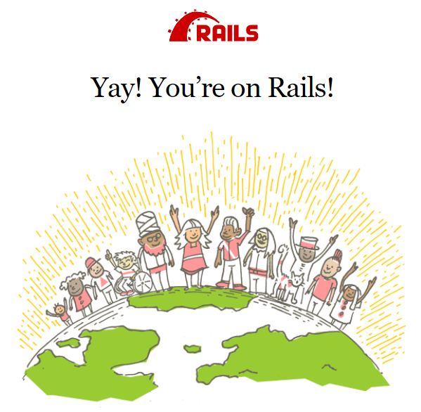

# Docker with Ruby on Rails

> Docker can help there because we can make one or more images that can then be converted into running containers, and those containers can run on our different developer, and even designer machines.

  

## Why use docker

With docker we prevent installation of a bunch of things on our computer, and we can use the same configuration with a MACos, Linux and Windows team members.

## Dockerfile and docker-compose file

Here is where most of the operations happens. Think of these two files as set of instructions of Docker follows on how to setup your virtual container.

## How run your application:

- `docker-compose build`: Running this command will get Dockerfile and install all the necessary things to make a rails development environment. Note that the installation may take a while because docker will need to download the necessary packages.
- `docker-compose run --rm --service-ports ruby_dev`: This command will start a bash terminal that will be your rails development environment where the rails commands are available. Notice that our command has some flags, `--rm` means remove the container after using it, and `--service-ports` means use port 3000 in our container so we can see our rails server on action. Then `ruby_dev` also came from services found at our `docker-compose.yaml`

### Test run a rails app:

1. Run `rails new awesomeApp && cd awesomeApp` this command will create a new rails app in a folder named awesomeApp.
2. Update and install gems. Run `bundle update && bundle install`, just make sure you're in the project folder.
3. Test the server by running `rails server -p $PORT -b 0.0.0.0` here we can use it in our case the port 3000. Don't forget to put `-b 0.0.0.0` because you won't see the app on your local machine
4. Stop the server by pressing `ctrl-d`

### Clean up

- Run `docker-compose down` for clean up and remove the container

## Docker commands:

- `FROM ruby` - This means docker will pull a pre-built setup by ruby. You don't need to think about updating on your machine the latest ruby version. You'll see the list of Docker's pre-built images on their DockerHub. Think of it as like npm.
- `WORKDIR /home/app` - Work directory. Work directory means this is be your default folder location when you start your development environment. You can name name it whatever you want.
- `ENV PORT 3000` - Environment variable. This will set a variable named $PORT on your bash terminal to be `3000`.
- `EXPOSE $PORT` - Expose port 3000 (that we've set earlier) of the virtual container to your local machine.
- `RUN` - Run commands are some setup instructions that you want the terminal to run before you use it. In our case, we installed ruby on rails, bundler, and node.js before we even use the development environment so it's all ready when we use it.
- `ENTRYPOINT ["/bin/bash"]` - This command tells docker what command to execute when we run the container. In our case, we need to run bash terminal so we can have access to rails.

## docker-compose:

Looks like a docker file, but with a little indentation.

- `version` - Through time, docker-compose file went through changes. That's why in docker-compose files, they need to specify which version they are using. In our case we just use the latest version as of this time.
- `services` - Specify list of services. As I said earlier, you can have many services like a rails server, and a MySQL server on your project. You can name your services any name you want. I named it `ruby_dev`.
- `build`: `.` - The dot here means a file path where to find the Dockerfile, which is the build instructions.
- `container_name` - The name of the container.
- `ports`: - these are the ports to expose from the docker container to our host local machine. The pattern here is HOST:CONTAINER. In our case it's `"3000:3000"`. Which means we are letting the default Rails server port (3000) be available in our local machine's "localhost:3000".
- `volumes`: - volume means even if we quit or delete Docker, we can specify which files we can keep in our local machine. We put `./:/home/app` there because we named in our Dockerfile earlier the workdir to be `/home/app`.

## Links:

[Docker Hub](https://hub.docker.com/)

[Webpack configuration file not found rails 6](https://stackoverflow.com/questions/57891751/webpacker-configuration-file-not-found-rails-6-0-0)

[Install node in dockerfile](https://stackoverflow.com/questions/36399848/install-node-in-dockerfile)
